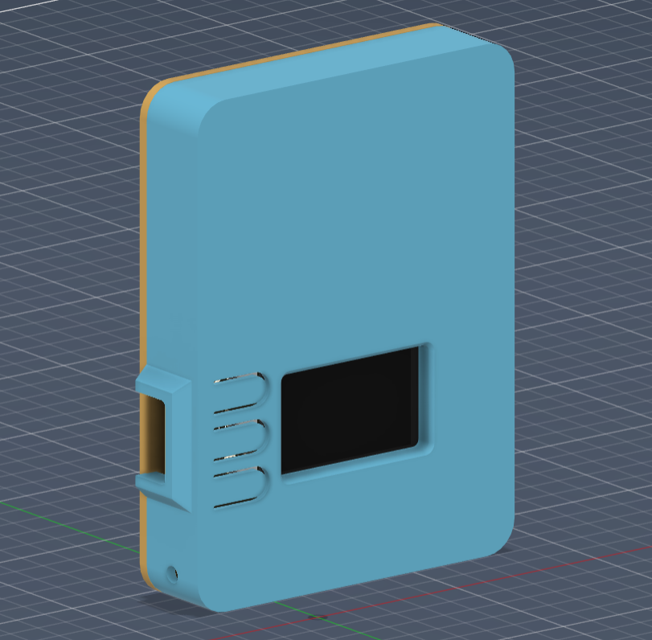
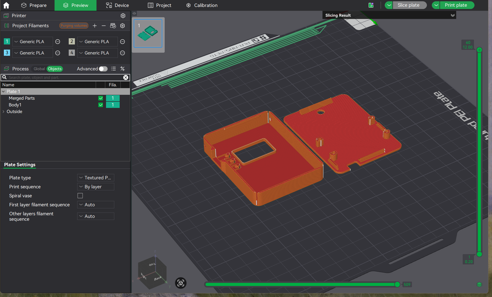
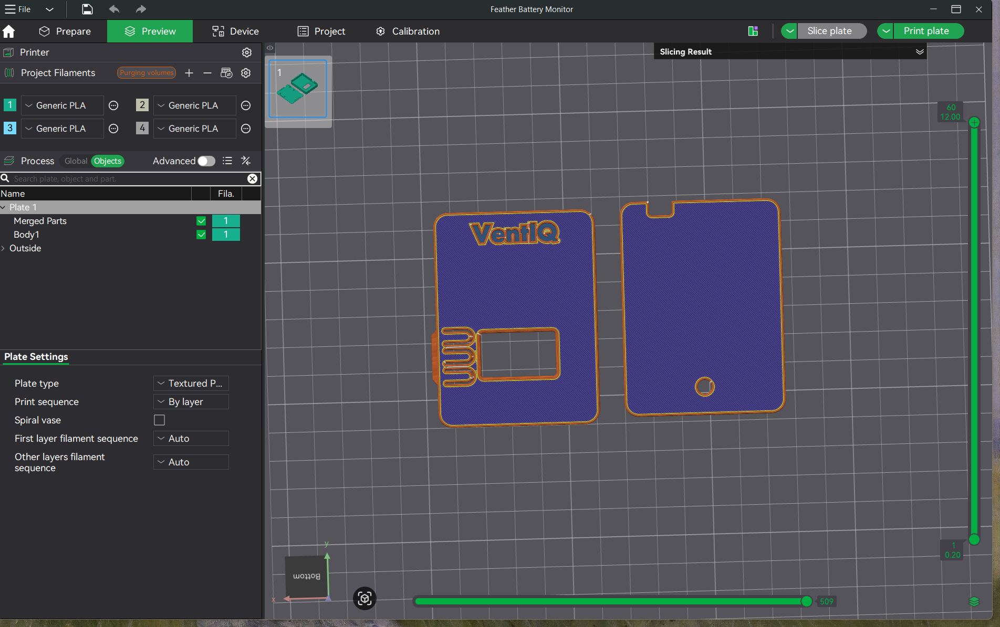
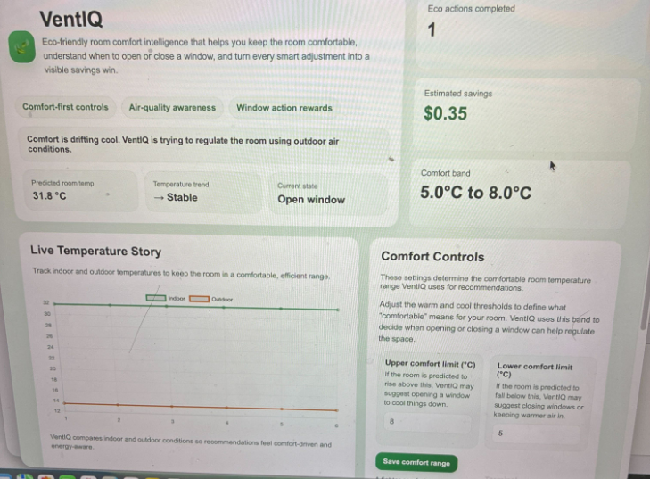

# VentIQ

## Overview

VentIQ is a smart indoor comfort and sustainability system that combines an environmental sensing device with a live web dashboard. The system measures indoor temperature, humidity, and air-quality-related conditions, compares them with outdoor weather data, and recommends actions that can improve comfort while reducing unnecessary energy use.

The dashboard presents live room insights, predicted temperature direction, comfort thresholds, and estimated savings from successful regulation actions. The goal is to make comfort management more intuitive, actionable, and sustainability-oriented.

## What the sensor does

The sensor device continuously collects:
- Indoor temperature
- Humidity
- Air quality proxy data

It also retrieves outdoor weather information using a network request and compares indoor and outdoor conditions to determine whether natural ventilation can improve the room.

The Feather logic uses recent indoor temperature history to estimate where the room temperature is heading. Instead of reacting only to the present value, it predicts the near-term direction of the room and issues recommendations earlier.

## What the dashboard does

The dashboard receives live sensor data and visualizes:
- Indoor vs. outdoor temperature trends
- Predicted room temperature
- Current room state
- User-defined comfort thresholds
- Estimated savings from efficient regulation actions
- Sound legend for alerts

The interface is designed to feel eco-friendly and easy to understand, turning raw sensor data into clear guidance.

## Why this is impactful for sustainability

VentIQ promotes passive comfort regulation before more energy-intensive heating or cooling is used. In many cases, natural airflow can improve comfort and freshness without relying immediately on HVAC systems.

This matters because the project connects environmental sensing with behavioral change. Rather than only showing data, VentIQ encourages timely actions that can reduce energy use, improve indoor comfort, and make sustainability more visible in everyday life.

By turning room regulation into estimated savings, the system helps users understand the practical value of low-energy choices and reinforces sustainable habits.

## Technical challenges

### 1. Location-aware weather integration
The system initially depended on a fixed city setting. It was improved to detect approximate location from the network and use that data to fetch more relevant weather conditions.

### 2. Hardware-to-dashboard communication
The sensor sends data over Wi-Fi to a Flask app running locally on a computer. This required correct local IP configuration, reliable POST requests, and graceful handling of network errors.

### 3. Predictive comfort logic
A key challenge was moving beyond simple threshold checks. The project uses recent temperature trend history to estimate near-future room conditions, making recommendations more proactive.

### 4. Translating technical readings into clear UX
Sensor outputs such as humidity, gas-related readings, and temperature trends are not always intuitive. A major design challenge was turning them into understandable recommendations, room states, and sustainability-focused feedback.

## Running locally

### Dashboard
1. Install Python 3.
2. Install Flask:
   `pip install flask`
3. Start the server:
   `python server.py`
4. Open:
   `http://localhost:5000`

### Feather code
1. Open `VentIQ.py`.
2. Replace the Wi-Fi credentials, weather API key, and local server IP with your own values.
3. Save it as `code.py` on the Feather.
4. Make sure the required CircuitPython libraries are installed.

## 3D Fabrication

### Physical UI Design

To extend VentIQ beyond the screen, we designed a **wall-mounted physical interface** that communicates room conditions in an ambient, glanceable way. The goal was to create a device that lives naturally within a home environment while continuously reflecting environmental changes.

The enclosure was modeled in CAD with a focus on **airflow, visibility, and integration of internal components**. Special attention was given to the front-facing elements for clear display feedback and access. The design also accounts for internal spacing for the Feather board and sensors, while maintaining a compact and minimal external form.

This approach transforms the system from something users actively check into something they can **passively perceive**, supporting more intuitive interaction with environmental data.

### CAD Design & Slicing

| CAD Design | Slicing Preview |
|------------|----------------|
|  |  |

- CAD design defines internal structure, mounting, and component layout  
- Slicing process ensures print feasibility and structural integrity  

---

### Fabrication & Final Outcome

The device was fabricated using a **Bambu 3D printer** with PLA, iterating on form, fit, and function. The final result is a compact, minimal enclosure that acts as a **physical extension of the VentIQ system**, enabling users to understand and respond to their environment without needing to open the dashboard.

### Final Device

| Front View | Assembled Model |
|------------|----------------|
|  |  |

---

### Demo Video

---

### Interaction Design Insight

This physical UI shifts VentIQ from a tool into an **ambient system**. Instead of requiring users to open a dashboard, the device provides continuous, low-effort awareness of room conditions and reinforces timely actions such as opening a window for natural ventilation.

By embedding feedback directly into the environment, VentIQ supports more **natural decision-making and sustainable behavior**, bridging the gap between environmental data and real-world action.
